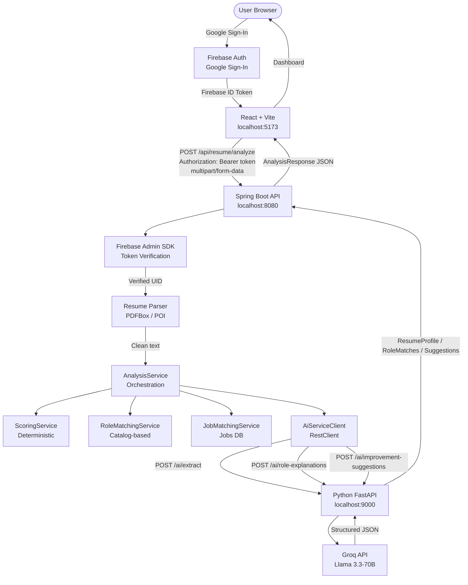
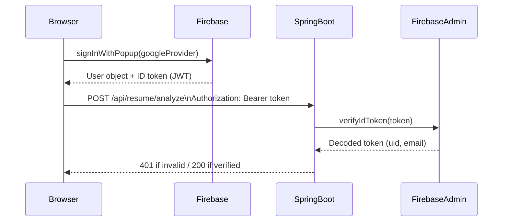
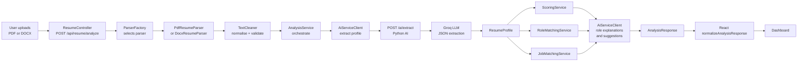
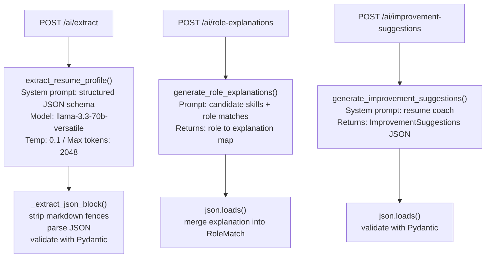

# ResumeIQ

### AI-Powered Resume Analyzer & Job Matcher

ResumeIQ analyzes your resume with an LLM, scores it across eight dimensions, matches you to job roles, surfaces skill gaps, and generates personalized improvement suggestions — all in a single upload.

---

## Table of Contents

1. [Overview](#overview)
2. [Why ResumeIQ?](#why-resumeiq)
3. [Core Features](#core-features)
4. [System Architecture](#system-architecture)
5. [Authentication Architecture](#authentication-architecture)
6. [Resume Analysis Pipeline](#resume-analysis-pipeline)
7. [AI Processing Pipeline](#ai-processing-pipeline)
8. [Scoring System](#scoring-system)
9. [Role & Job Matching](#role--job-matching)
10. [Technology Stack](#technology-stack)
11. [Project Structure](#project-structure)
12. [Prerequisites](#prerequisites)
13. [Environment Configuration](#environment-configuration)
14. [Firebase Configuration](#firebase-configuration)
15. [Quick Start — macOS / Linux](#quick-start--macos--linux)
16. [Quick Start — Windows](#quick-start--windows)
17. [Manual Development Setup](#manual-development-setup)
18. [API Reference](#api-reference)
19. [Security](#security)
20. [Error Handling](#error-handling)
21. [Testing](#testing)
22. [Troubleshooting](#troubleshooting)
23. [Future Improvements](#future-improvements)
24. [License](#license)

---

## Overview

ResumeIQ is a full-stack, cloud-authenticated web application that turns a raw resume PDF or DOCX into actionable career intelligence.

The application is split into three independent services:

| Service | Technology | Port |
|---|---|---|
| Frontend | React 19 + Vite | `5173` |
| Backend API | Java 21 + Spring Boot 3.2 | `8080` |
| AI Microservice | Python 3.11 + FastAPI | `9000` |

Authentication is handled end-to-end via Firebase: the browser performs Google Sign-In, obtains a Firebase ID token, and every backend API request is cryptographically verified by the Firebase Admin SDK before any business logic executes.

---

## Why ResumeIQ?

Most resume tools are either basic keyword-matchers or expensive SaaS products. ResumeIQ is:

- **Open and inspectable** — every scoring rule and prompt is visible in source code.
- **LLM-powered extraction** — Groq (Llama 3.3-70B) extracts structured profile data rather than relying on fragile regex parsing.
- **Deterministic scoring** — the 0–100 resume readiness score is computed in Java with documented, reproducible weights. The LLM is never asked to produce a score.
- **Secure by design** — Firebase ID tokens are cryptographically verified on the backend. Credentials never reach the browser or the AI service.

---

## Core Features

| Feature | Detail |
|---|---|
| **Resume parsing** | PDF (Apache PDFBox) and DOCX (Apache POI) |
| **AI extraction** | Candidate name, summary, skills, experience, projects, education, certifications, achievements, soft skills |
| **Resume readiness score** | 0–100, eight weighted categories |
| **Score breakdown** | Per-category scores with strengths, weaknesses, and improvement priorities |
| **Role matching** | Top-5 best-fit roles from a 10-role catalog with % match, matched skills, missing required/preferred |
| **Job matching** | Top-5 real job listings matched against resume skills |
| **Skill gap analysis** | High / medium / low priority skill gaps against the top matched role |
| **AI role explanations** | One-sentence LLM explanation of why each role fits the candidate |
| **Improvement suggestions** | LLM-generated: summary rewrite hint, bullet-point suggestions, keyword suggestions, general tips |
| **Firebase Google Auth** | Secure sign-in; protected routes; token-verified API |

---

## System Architecture



---

## Authentication Architecture

Firebase Google Sign-In is the only supported authentication mechanism. Email/password sign-up also exists in `AuthContext` but the primary flow is Google OAuth.



**Key security properties:**
- The Firebase ID token is a short-lived, cryptographically signed JWT.
- Spring Boot's `FirebaseAuthenticationFilter` intercepts every `/api/**` request.
- OPTIONS (preflight) requests bypass the filter — required for CORS.
- `/api/jobs` and `/api/analysis/roles` are explicitly public.
- `/api/resume/analyze` is always protected.
- The Firebase service-account JSON lives exclusively on the backend.

---

## Resume Analysis Pipeline



**Step-by-step:**

1. User uploads a PDF or DOCX file via the browser.
2. `ResumeController` receives the `multipart/form-data` request (protected by `FirebaseAuthenticationFilter`).
3. `ParserFactory` selects either `PdfResumeParser` (Apache PDFBox) or `DocxResumeParser` (Apache POI).
4. `TextCleaner` normalises whitespace and validates the text is meaningful (minimum 30 characters).
5. `AnalysisService` orchestrates the pipeline in sequence:
   - **AI extraction** → `ResumeProfile` via Groq
   - **Scoring** → deterministic 0-100 score
   - **Role matching** → top-5 catalog roles
   - **Job matching** → top-5 from `jobs.json`
   - **Skill gap analysis** → against top matched role
   - **AI role explanations** → one-sentence per role
   - **AI improvement suggestions** → actionable feedback
6. The `AnalysisResponse` JSON is returned to React.
7. `normalizeAnalysisResponse()` ensures every field has a safe default before rendering.

---

## AI Processing Pipeline

The Python AI microservice wraps three Groq API calls, each isolated in its own FastAPI endpoint:



**Reliability features:**
- `_extract_json_block()` strips any markdown code fences the model might emit.
- Role percentages are calculated in Java and sent to the AI — the LLM is instructed not to change them.
- `AiServiceClient` gracefully degrades on role-explanation and suggestion failures.

---

## Scoring System

The resume readiness score is computed entirely in Java by `ScoringService`. The LLM is **not** involved in scoring.

### Category Weights

| Category | Max Points | Scoring Basis |
|---|---|---|
| **Skills** | 20 | Count of unique technical skills (languages, frameworks, databases, cloud tools) |
| **Experience** | 20 | Number of experience entries + bonus for numerical metrics |
| **Projects** | 15 | Count and average description length |
| **ATS Readiness** | 15 | Action verb coverage, tech keyword density, quantified metrics |
| **Education** | 10 | Presence and detail level of education entries |
| **Structure** | 10 | Count of standard sections present |
| **Certifications** | 5 | Count of certifications |
| **Achievements** | 5 | Count of achievements |
| **Total** | **100** | |

### Improvement Priorities

The top 5 largest score gaps (max weight − actual score) are sorted and returned as `improvement_priorities` — giving candidates the highest-ROI actions first.

---

## Role & Job Matching

### Role Matching

`RoleMatchingService` matches the candidate against a catalog of 10 roles:

`Software Engineer` · `Backend Developer` · `Java Developer` · `Python Developer` · `Full Stack Developer` · `Data Analyst` · `Data Engineer` · `Machine Learning Engineer` · `DevOps Engineer` · `QA Engineer`

Match percentage formula:

```
match% = (matched_required / total_required × 0.70
        + matched_preferred / total_preferred × 0.30) × 100
```

`SkillNormalizationService` handles case-insensitive and alias matching (e.g. `JS` → `JavaScript`).

### Job Matching

`JobMatchingService` matches the resume against 32 real job listings loaded from `jobs.json` at startup using the same formula. Top-5 matches are returned with matched and missing skills.

---

## Technology Stack

### Frontend

| Technology | Version | Purpose |
|---|---|---|
| React | 19 | UI framework |
| Vite | 8 | Dev server + bundler |
| React Router | 7 | Client-side routing |
| Axios | 1.x | HTTP client with request interceptors |
| Firebase JS SDK | 12 | Google Sign-In, auth state |
| Lucide React | 1.x | Icons |

### Backend (Java)

| Technology | Version | Purpose |
|---|---|---|
| Java | 21 | Runtime |
| Spring Boot | 3.2 | Application framework |
| Spring Security | 6 | Filter chain, stateless auth |
| Firebase Admin SDK | 9.2 | Server-side ID token verification |
| Apache PDFBox | 3.0 | PDF text extraction |
| Apache POI | 5.2 | DOCX text extraction |
| Jackson | Spring managed | JSON serialisation |
| Maven | wrapper | Build tool |

### AI Microservice (Python)

| Technology | Purpose |
|---|---|
| Python 3.11+ | Runtime |
| FastAPI | HTTP framework |
| Uvicorn | ASGI server |
| Groq SDK | LLM API client (Llama 3.3-70B) |
| Pydantic | Schema validation |
| python-dotenv | `.env` loading |

---

## Project Structure

```
ResumeIQ/
├── frontend/                          # React + Vite application
│   ├── src/
│   │   ├── components/                # UI components
│   │   │   ├── ErrorBoundary.jsx
│   │   │   ├── JobMatches.jsx
│   │   │   ├── ProtectedRoute.jsx
│   │   │   ├── ResumeProfile.jsx
│   │   │   ├── RoleMatches.jsx
│   │   │   ├── ScoreBreakdown.jsx
│   │   │   ├── ScoreCard.jsx
│   │   │   ├── SkillGaps.jsx
│   │   │   ├── Suggestions.jsx
│   │   │   └── UploadResume.jsx
│   │   ├── context/
│   │   │   └── AuthContext.jsx        # Firebase auth state + providers
│   │   ├── pages/
│   │   │   ├── Login.jsx
│   │   │   └── Profile.jsx
│   │   ├── services/
│   │   │   └── api.js                 # Axios instance + Firebase token interceptor
│   │   ├── utils/
│   │   │   └── normalizeAnalysis.js   # Safe response normalisation
│   │   ├── firebase.js                # Firebase app initialisation
│   │   ├── App.jsx                    # Routes + Dashboard
│   │   └── index.css
│   ├── .env                           # Local environment (gitignored)
│   ├── .env.example                   # Template (committed)
│   └── package.json
│
├── backend/
│   └── resumeiq-api/                  # Spring Boot application
│       ├── src/main/java/com/resumeiq/
│       │   ├── ai/
│       │   │   └── AiServiceClient.java     # RestClient calls to Python AI
│       │   ├── config/
│       │   │   ├── AppConfig.java           # RestClient.Builder bean
│       │   │   ├── FirebaseConfig.java      # Firebase Admin SDK init
│       │   │   └── SecurityConfig.java      # Spring Security + CORS
│       │   ├── controller/
│       │   │   ├── AnalysisController.java  # GET /api/analysis/roles
│       │   │   ├── JobController.java       # GET /api/jobs
│       │   │   └── ResumeController.java    # POST /api/resume/analyze
│       │   ├── dto/                         # Request/response DTOs
│       │   ├── exception/                   # GlobalExceptionHandler
│       │   ├── matching/
│       │   │   ├── JobMatchingService.java
│       │   │   ├── RoleMatchingService.java
│       │   │   └── SkillNormalizationService.java
│       │   ├── parser/
│       │   │   ├── DocxResumeParser.java
│       │   │   ├── ParserFactory.java
│       │   │   ├── PdfResumeParser.java
│       │   │   └── ResumeParser.java        # Interface
│       │   ├── scoring/
│       │   │   └── ScoringService.java      # Deterministic 0-100 scorer
│       │   ├── security/
│       │   │   └── FirebaseAuthenticationFilter.java
│       │   ├── service/
│       │   │   ├── AnalysisService.java     # Pipeline orchestration
│       │   │   └── JobService.java          # jobs.json loader
│       │   └── util/
│       │       └── TextCleaner.java
│       ├── src/main/resources/
│       │   ├── application.properties
│       │   └── jobs.json                    # 32 job listings
│       ├── src/test/                        # JUnit 5 tests (11 tests)
│       ├── pom.xml
│       └── mvnw
│
├── ai-service/                        # Python FastAPI AI microservice
│   ├── models/
│   │   └── schemas.py                 # Pydantic request/response models
│   ├── services/
│   │   └── groq_service.py            # Groq API calls + JSON parsing
│   ├── app.py                         # FastAPI app + routes
│   ├── requirements.txt
│   └── .env.example
│
├── secrets/                           # LOCAL ONLY — never committed
│   └── firebase-service-account.json
│
├── .env.example                       # Root environment template
├── .gitignore
└── README.md
```

---

## Prerequisites

| Requirement | Minimum Version | Check |
|---|---|---|
| Node.js | 18 | `node --version` |
| Java JDK | 21 | `java --version` |
| Python | 3.11 | `python3 --version` |
| Groq API key | — | [console.groq.com](https://console.groq.com) |
| Firebase project | — | [console.firebase.google.com](https://console.firebase.google.com) |

---

## Environment Configuration

### Root `.env` (used by the Python AI service)

Copy `.env.example` to `.env` at the project root:

```env
GROQ_API_KEY=gsk_...
GROQ_MODEL=llama-3.3-70b-versatile
```

### Frontend `frontend/.env`

Copy `frontend/.env.example` to `frontend/.env`:

```env
VITE_FIREBASE_API_KEY=AIza...
VITE_FIREBASE_AUTH_DOMAIN=resumeiq-08.firebaseapp.com
VITE_FIREBASE_PROJECT_ID=resumeiq-08
VITE_FIREBASE_STORAGE_BUCKET=resumeiq-08.appspot.com
VITE_FIREBASE_MESSAGING_SENDER_ID=...
VITE_FIREBASE_APP_ID=...
VITE_API_BASE_URL=http://localhost:8080
```

> **Note:** These are public client-side Firebase configuration values. They are safe to include in the frontend `.env` and are not credentials.

### Backend environment variable

Export this before starting Spring Boot:

```bash
export FIREBASE_CREDENTIALS_PATH=/absolute/path/to/secrets/firebase-service-account.json
```

> **Warning:** The `secrets/` directory is gitignored. Never commit the service-account JSON.

---

## Firebase Configuration

### 1. Create a Firebase project

1. Go to the [Firebase Console](https://console.firebase.google.com).
2. Create or select a project.
3. In **Authentication → Sign-in method**, enable **Google**.

### 2. Register a web app

1. In **Project settings → Your apps**, add a Web app.
2. Copy the config object into `frontend/.env`.

### 3. Generate a service-account key

1. In **Project settings → Service accounts**, click **Generate new private key**.
2. Download the JSON file.
3. Move it to `secrets/firebase-service-account.json`.
4. Verify it is gitignored:
   ```bash
   git check-ignore -v secrets/firebase-service-account.json
   ```
5. Export the path before starting Spring Boot:
   ```bash
   export FIREBASE_CREDENTIALS_PATH=/absolute/path/to/secrets/firebase-service-account.json
   ```

---

## Quick Start — macOS / Linux

Open three terminal tabs.

**Terminal 1 — Python AI service**

```bash
cd ~/Projects/ResumeIQ/ai-service
python3 -m venv .venv
source .venv/bin/activate
pip install -r requirements.txt
uvicorn app:app --host 127.0.0.1 --port 9000
```

**Terminal 2 — Spring Boot backend**

```bash
cd ~/Projects/ResumeIQ/backend/resumeiq-api
export FIREBASE_CREDENTIALS_PATH=/absolute/path/to/secrets/firebase-service-account.json
./mvnw spring-boot:run
```

**Terminal 3 — React frontend**

```bash
cd ~/Projects/ResumeIQ/frontend
npm install
npm run dev
```

Open [http://localhost:5173](http://localhost:5173).

---

## Quick Start — Windows

**Window 1 — Python AI service**

```powershell
cd C:\Projects\ResumeIQ\ai-service
python -m venv .venv
.venv\Scripts\activate
pip install -r requirements.txt
uvicorn app:app --host 127.0.0.1 --port 9000
```

**Window 2 — Spring Boot backend**

```powershell
cd C:\Projects\ResumeIQ\backend\resumeiq-api
$env:FIREBASE_CREDENTIALS_PATH = "C:\Projects\ResumeIQ\secrets\firebase-service-account.json"
.\mvnw.cmd spring-boot:run
```

**Window 3 — React frontend**

```powershell
cd C:\Projects\ResumeIQ\frontend
npm install
npm run dev
```

Open [http://localhost:5173](http://localhost:5173).

---

## Manual Development Setup

### Backend tests

```bash
cd backend/resumeiq-api
./mvnw clean test
# Tests run: 11, Failures: 0, Errors: 0, Skipped: 0
```

Test coverage:
- `ScoringServiceTest` — score calculation and missing sections detection
- `RoleMatchingServiceTest` — match percentage formula
- `SkillNormalizationServiceTest` — case and alias normalisation
- `JobMatchingServiceTest` — top-N job selection
- `TextCleanerTest` — whitespace normalisation and meaningfulness check

### Backend: build JAR

```bash
./mvnw clean package
# produces: target/resumeiq-api-0.0.1-SNAPSHOT.jar
```

### Frontend: production build

```bash
cd frontend
npm run build
# produces: dist/
```

---

## API Reference

All Spring Boot endpoints are on `http://localhost:8080`.

### Public endpoints

| Method | Path | Description |
|---|---|---|
| `GET` | `/api/jobs` | Returns all 32 job listings |
| `GET` | `/api/analysis/roles` | Returns the 10-role matching catalog |

### Protected endpoint

Requires `Authorization: Bearer <Firebase ID token>`.

| Method | Path | Body | Description |
|---|---|---|---|
| `POST` | `/api/resume/analyze` | `multipart/form-data` field `file` (PDF or DOCX, max 10 MB) | Full resume analysis pipeline |

### Python AI service (internal)

| Method | Path | Description |
|---|---|---|
| `GET` | `/` | Health check |
| `POST` | `/ai/extract` | LLM extraction → `ResumeProfile` |
| `POST` | `/ai/role-explanations` | LLM explanation per role |
| `POST` | `/ai/improvement-suggestions` | LLM improvement feedback |

### `AnalysisResponse` JSON shape

```json
{
  "resume_profile": {
    "candidate_name": "string",
    "professional_summary": "string",
    "education": ["string"],
    "skills": ["string"],
    "programming_languages": ["string"],
    "frameworks": ["string"],
    "databases": ["string"],
    "cloud_tools": ["string"],
    "experience": ["string"],
    "projects": ["string"],
    "certifications": ["string"],
    "achievements": ["string"],
    "soft_skills": ["string"]
  },
  "score": {
    "overall_score": 74.5,
    "categories": {
      "skills": 20.0,
      "experience": 17.0,
      "projects": 12.0,
      "education": 10.0,
      "structure": 9.0,
      "ats_readiness": 4.0,
      "certifications": 0.0,
      "achievements": 2.5
    },
    "strengths": ["string"],
    "weaknesses": ["string"],
    "improvement_priorities": ["string"]
  },
  "role_matches": [
    {
      "role": "string",
      "match_percentage": 85.0,
      "matched_skills": ["string"],
      "missing_required": ["string"],
      "missing_preferred": ["string"],
      "explanation": "string"
    }
  ],
  "job_matches": [
    {
      "job_id": 1,
      "title": "string",
      "company": "string",
      "location": "string",
      "employment_type": "string",
      "experience": "string",
      "match_percentage": 72.0,
      "matched_skills": ["string"],
      "missing_skills": ["string"]
    }
  ],
  "skill_gaps": {
    "target_role": "string",
    "existing_skills": ["string"],
    "gaps": {
      "high": ["string"],
      "medium": ["string"],
      "low": []
    }
  },
  "suggestions": {
    "summary_suggestion": "string",
    "bullet_point_suggestions": ["string"],
    "missing_sections": ["string"],
    "keyword_suggestions": ["string"],
    "general_suggestions": ["string"]
  }
}
```

---

## Security

### What is protected

- `POST /api/resume/analyze` requires a valid, unexpired Firebase ID token for project `resumeiq-08`.
- `FirebaseAuthenticationFilter` verifies every token cryptographically before any business logic runs.
- On token failure the filter returns `401 Unauthorized` with `{"error": "..."}` — never a misleading 403.
- CORS is restricted to `http://localhost:5173` in `SecurityConfig.java`.
- Session creation is `STATELESS` — no server-side sessions.
- CSRF is disabled (appropriate for a stateless Bearer-token API).

### What stays server-side only

| Secret | Location | Never sent to |
|---|---|---|
| Firebase service-account JSON | `secrets/` (gitignored) | Browser, Python AI service, logs |
| Groq API key | `.env` (gitignored) | Browser, Spring Boot |
| Firebase Admin credentials | JVM memory only | Any HTTP response |

### Git protection

```gitignore
.env
secrets/
firebase-service-account.json
serviceAccountKey.json
*.firebase.json
```

Verify before committing:

```bash
git check-ignore -v secrets/firebase-service-account.json
git status
```

---

## Error Handling

### Spring Boot errors (returned as `{ "detail": "..." }` JSON)

| HTTP Status | Cause |
|---|---|
| `401` | Missing or invalid Firebase ID token |
| `413` | File exceeds 10 MB limit |
| `422` | File is empty, unreadable, or unsupported format |
| `503` | AI microservice is unavailable |
| `500` | Unexpected server error (stack trace logged server-side, not exposed) |

### Frontend (`api.js`)

The Axios interceptor maps each status code to a user-friendly message. Stack traces and internal details are never forwarded to the UI.

---

## Testing

### Manual API verification

```bash
# Health check — Python AI service
curl -s http://localhost:9000/

# CORS preflight — must return 200 without auth
curl -i -X OPTIONS http://localhost:8080/api/resume/analyze \
  -H "Origin: http://localhost:5173" \
  -H "Access-Control-Request-Method: POST" \
  -H "Access-Control-Request-Headers: authorization"

# Unauthenticated request — must return 401
curl -i -X POST http://localhost:8080/api/resume/analyze
```

---

## Troubleshooting

### `401 Unauthorized` on resume upload

- Your Firebase session expired. Log out and sign in again.
- `VITE_FIREBASE_PROJECT_ID` in `frontend/.env` does not match the backend's `resumeiq-08`.

### Spring Boot fails to start — Firebase error

- `FIREBASE_CREDENTIALS_PATH` is not exported in the current terminal.
- The path points to a missing or invalid service-account JSON file.

### `503 Service Unavailable` on resume analyze

- The Python AI service is not running on port 9000.
- `GROQ_API_KEY` or `GROQ_MODEL` is missing from the AI service's `.env`.

### `422 Unprocessable Entity`

- The uploaded file is empty, a scanned image-only PDF, or not a PDF/DOCX.

### Port already in use

```bash
# macOS / Linux
lsof -ti:8080 | xargs kill -9
lsof -ti:9000 | xargs kill -9
lsof -ti:5173 | xargs kill -9
```

### Frontend shows no data after a 200 response

Open the browser console. `normalizeAnalysis.js` provides safe defaults — if the response JSON is valid, all components should render without crashing.

---

## Future Improvements

- **Docker Compose** — single-command startup for all three services.
- **Resume history** — store previous analyses per user in Firestore or PostgreSQL.
- **PDF/image OCR** — support scanned PDFs via Tesseract or a cloud Vision API.
- **CI/CD pipeline** — GitHub Actions for automated test + build on push.
- **Production CORS** — parameterise allowed origins via environment variable.
- **Rate limiting** — prevent Groq API cost overruns on the AI microservice.
- **Multiple LLM providers** — abstract the AI layer to support OpenAI, Anthropic, and local models.
- **DOCX export** — download an improved resume draft based on the AI suggestions.

---

## License

This project is released under the [MIT License](LICENSE).

---

*Built with Java 21 · Spring Boot 3.2 · React 19 · Vite 8 · Python 3.11 · FastAPI · Firebase · Groq*
